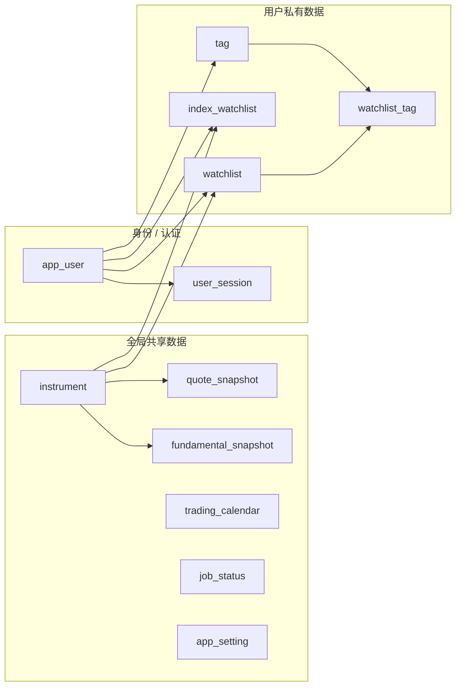

# MarketMind 多用户与认证技术方案

> 状态：方案草案  
> 基线：MarketMind `main` 分支（2026-09-13）  
> 范围：多用户、登录认证、普通用户/管理员双角色、用户数据隔离、管理员能力  
> 非目标：本阶段不引入复杂 RBAC、OAuth/SSO、多租户组织模型，也不把系统改造成高并发 SaaS

---

## 1. 背景

MarketMind 当前定位为基于 FastAPI + Jinja2 + DuckDB 的单体证券研究工具。现有业务数据模型整体按照“单用户”假设设计：

- `watchlist` 以 `instrument_id` 为主键，同一证券全库只能有一条自选记录；
- `index_watchlist` 同样以 `instrument_id` 为主键；
- `tag` 为全局标签，标签重名检查也是全库范围；
- `watchlist_tag` 只通过 `instrument_id + tag_id` 表达自选与标签的关系；
- `/api/admin/*` 已存在管理用途接口，但当前没有真正的身份认证和管理员授权边界；
- 行情、基本面、交易日历、后台刷新等能力天然属于全局共享市场数据。

本次改造的目标不是简单增加登录页面，而是把**用户身份加入业务数据模型**，让用户私有数据能够可靠隔离，同时继续复用全局市场数据、行情缓存和后台刷新任务。

---

## 2. 目标

本方案需要实现：

1. 支持多个用户独立登录使用 MarketMind；
2. 支持两种角色：
   - `user`：普通用户；
   - `admin`：管理员；
3. 管理员可以创建用户、禁用用户、重置密码、分配角色；
4. 每个用户拥有独立的：
   - 股票/ETF 自选；
   - 指数自选；
   - 标签；
   - 自选与标签关系；
5. 市场基础数据继续全局共享，不按用户重复保存；
6. `/api/admin/*` 建立真实管理员权限边界；
7. 尽量保持现有 FastAPI + Jinja2 + DuckDB + Repository/Service 分层；
8. 保持现有单进程、单 Writer 的 DuckDB 部署模式。

---

## 3. 非目标

本阶段明确不做：

- OAuth / OIDC / SAML / 企业 SSO；
- 微信、GitHub 等第三方登录；
- 组织、团队、租户、部门模型；
- 可动态配置的 Permission/RBAC 权限系统；
- 一个用户绑定多个角色；
- 管理员默认查看任意用户的自选、标签等私有数据；
- 多进程/多实例共享写同一 DuckDB；
- 将用户系统拆成独立微服务；
- PostgreSQL/Redis 强制迁移。

当前只有 `user/admin` 两种角色，直接在用户表中保存角色即可。等未来出现研究员、运营、只读用户等更复杂角色时，再演进到完整 RBAC。

---

## 4. 核心设计原则

### 4.1 身份是业务数据的一等维度

所有“属于某个人”的查询和写入必须明确携带服务端解析出的 `user_id`。

普通业务 API **不允许从客户端传入 `user_id` 来决定数据归属**。

推荐链路：

```text
Browser
  ↓ HttpOnly Session Cookie
Authentication Dependency
  ↓
CurrentUser(user_id, role)
  ↓
API / Page
  ↓
Service(user_id)
  ↓
Repository(user_id)
  ↓
DuckDB
```

### 4.2 默认拒绝，而不是默认放行

- 未登录：只能访问明确列入白名单的公共路由；
- 已登录普通用户：只能访问自己的私有数据；
- 管理员：额外拥有用户管理和系统管理能力；
- 管理员不会因为角色是 `admin` 就自动绕过用户数据隔离。

### 4.3 用户私有数据和市场共享数据分开

用户之间共享证券主数据、行情、基本面、交易日历等数据。

例如 20 个用户都关注贵州茅台：

- `instrument` 仍然只有一条贵州茅台；
- 行情快照仍然只有一份；
- 每个用户分别拥有自己的 `watchlist` 记录；
- 后台行情刷新只需要刷新一次该证券。

### 4.4 用户作用域 Repository 和系统作用域 Repository 分开

不要设计：

```python
WatchlistRepository(session, user_id=None)
```

并用 `None` 表示“管理员/系统查看全部”。

这很容易因为漏传 `user_id` 产生越权。

推荐明确区分：

```text
WatchlistRepository(session, user_id)       # 用户作用域
SystemWatchlistRepository(session)           # 后台任务作用域
```

只有后台行情任务等明确的系统路径可以使用 `SystemWatchlistRepository`。

---

## 5. 数据边界

### 5.1 当前表的分类

| 表 | 边界 | 说明 |
|---|---|---|
| `instrument` | 全局共享 | 证券/ETF/指数主数据 |
| `quote_snapshot` | 全局共享 | 当前行情快照 |
| `fundamental_snapshot` | 全局共享 | 基本面/估值快照 |
| `trading_calendar` | 全局共享 | 交易日历 |
| `job_status` | 全局共享 | 后台任务状态 |
| `app_setting` | 全局共享 | 系统级设置 |
| `watchlist` | **改为用户私有** | 每个用户自己的股票/ETF 自选 |
| `index_watchlist` | **改为用户私有** | 每个用户自己的指数配置 |
| `tag` | **改为用户私有** | 每个用户自己的标签命名空间 |
| `watchlist_tag` | **改为用户私有** | 用户自选与用户标签的关联 |
| `app_user` | 身份域 | 新增，用户账户与角色 |
| `user_session` | 身份域 | 新增，登录会话 |

### 5.2 数据边界图



### 5.3 未来新表的判断规则

未来新增表时，可按以下规则判断：

**适合全局共享：**

- 只由市场、证券、日期决定；
- 与“哪个用户查看”无关；
- 多用户重复保存没有业务价值。

例如：

- 历史行情；
- 财务报表；
- 市场估值指标；
- 交易日历；
- 系统任务状态。

**适合用户私有：**

- 由用户主动创建；
- 包含个人偏好；
- 同一对象不同用户可以有不同内容。

例如：

- 投资组合；
- 研究笔记；
- 告警规则；
- 用户自定义筛选条件；
- 个性化回测参数；
- 页面偏好。

如果未来的分析/回测完全由公开市场参数决定，可以全局缓存；如果包含用户个人参数、持仓或策略，则结果应带 `user_id`。

---

## 6. 权限模型

### 6.1 角色

第一阶段只定义两个角色：

```text
user
admin
```

用户只拥有一个角色，不增加 `role`、`permission`、`user_role` 多张 RBAC 表。

### 6.2 权限矩阵

本方案推荐**默认所有业务页面要求登录**。如果未来需要公开行情，再单独建立 `public` 路由，不让现有私有 API 被“顺手公开”。

| 功能 | 匿名用户 | 普通用户 | 管理员 |
|---|:---:|:---:|:---:|
| 访问登录页 | ✅ | ✅ | ✅ |
| 登录 | ✅ | - | - |
| 退出登录 | - | ✅ | ✅ |
| 查看 `/health` | ✅ | ✅ | ✅ |
| 查看个人首页行情 | - | ✅ | ✅ |
| 查询共享行情/基本面 | - | ✅ | ✅ |
| 管理自己的股票/ETF 自选 | - | ✅ | ✅ |
| 管理自己的指数自选 | - | ✅ | ✅ |
| 管理自己的标签 | - | ✅ | ✅ |
| 修改自己的密码 | - | ✅ | ✅ |
| 查看自己的账户信息 | - | ✅ | ✅ |
| 查看用户列表 | - | - | ✅ |
| 创建用户 | - | - | ✅ |
| 启用/禁用用户 | - | - | ✅ |
| 给用户分配 `user/admin` 角色 | - | - | ✅ |
| 为用户重置密码 | - | - | ✅ |
| 查看 `/api/admin/status` | - | - | ✅ |
| 触发 `/api/admin/refresh/*` | - | - | ✅ |
| 管理系统级配置（未来） | - | - | ✅ |
| 查看其他用户私有自选/标签 | - | ❌ | **默认 ❌** |
| 修改其他用户私有自选/标签 | - | ❌ | **默认 ❌** |

### 6.3 管理员的边界

管理员角色表达的是：

> “可以管理账户和系统”。

而不是：

> “可以绕过所有用户数据隔离”。

因此第一阶段管理员拥有自己的自选和标签，其私有数据查询与普通用户走完全相同的 `user_id` 过滤。

如果以后确实需要“管理员代用户排查数据”，应新增显式、可审计的管理员能力，而不是在普通 Repository 中加入自动绕过逻辑。

---

## 7. 认证方案

### 7.1 方案选择

推荐：

**服务端 Session + HttpOnly Cookie**

暂不采用 JWT。

原因：

- MarketMind 当前是 FastAPI + Jinja2 + 原生 JS 的同源单体；
- 不存在移动端/第三方客户端 Token 分发需求；
- Session 的登录、退出、失效、禁用用户处理更直接；
- 不需要 Refresh Token；
- 不需要把角色/身份信息长期保存在客户端 Token 内。

### 7.2 Session Cookie

建议 Cookie：

```text
name: marketmind_session
HttpOnly: true
SameSite: Lax
Secure: true     # 生产 HTTPS 环境
Path: /
```

开发环境本地 HTTP 可通过配置关闭 `Secure`。

Cookie 中只保存高强度随机 Session Token，不保存：

- `user_id`；
- `role`；
- 用户名；
- 权限列表。

### 7.3 Session Token 存储

浏览器持有：

```text
random_session_token
```

数据库只存：

```text
SHA-256(random_session_token)
```

这样数据库泄露时，不会直接得到可用于登录的 Cookie Token。

每次请求：

1. 从 Cookie 读取原始 token；
2. 计算 token hash；
3. 查 `user_session`；
4. 检查过期/撤销；
5. 加载 `app_user`；
6. 检查 `is_active`；
7. 生成 `CurrentUser`。

### 7.4 密码

密码只保存安全哈希，不保存明文，也不做可逆加密。

推荐：

```text
Argon2id
```

Python 可使用成熟的 Argon2 实现，例如 `pwdlib` / `argon2-cffi`。

密码重置后应使该用户已有 Session 失效。

### 7.5 CSRF

由于认证使用 Cookie，所有改变状态的请求应有 CSRF 防护：

- `POST`
- `PUT`
- `PATCH`
- `DELETE`

推荐由 Session 生成独立 CSRF Token：

```text
Cookie: marketmind_session=<session token>
Header: X-CSRF-Token=<csrf token>
```

Jinja2 页面可以把 CSRF Token 注入：

```html
<meta name="csrf-token" content="...">
```

前端 `fetch()` 统一添加 `X-CSRF-Token`。

### 7.6 Session 生命周期

建议：

- Session 有明确 `expires_at`；
- 默认有效期做成配置项，例如 7～14 天；
- 登录创建新 Session；
- 退出登录立即撤销当前 Session；
- 禁用用户时撤销其全部 Session；
- 重置密码时撤销其全部 Session；
- 修改角色后建议撤销其已有 Session；
- 不在每个请求都更新 `last_seen_at`，避免给 DuckDB 制造高频写操作。

---

## 8. 用户模型

建议新增 `app_user`，避免使用数据库保留词 `user` 作为表名。

概念字段：

```text
app_user
├── user_id              BIGINT PK
├── username             VARCHAR
├── password_hash        VARCHAR
├── role                 VARCHAR      # user / admin
├── is_active            BOOLEAN
├── must_change_password BOOLEAN
├── created_at           TIMESTAMPTZ
├── updated_at           TIMESTAMPTZ
└── last_login_at        TIMESTAMPTZ nullable
```

建议通过显式 sequence 生成 `user_id`，风格与当前 `tag_id` 保持一致。

### 8.1 用户名唯一性

用户名必须唯一。

考虑到当前项目已经因为 DuckDB 约束行为对 `tag.name` 采用“写锁内查询查重”的模式，用户表可以沿用同样的单 Writer 思路：

```text
WriteCoordinator
  → 查询 username 是否存在
  → 创建用户
  → commit
```

后续如果经过 DuckDB spike 验证 UNIQUE 约束在该表结构下无问题，也可以再增加数据库级唯一约束。

### 8.2 禁用优先于物理删除

第一阶段用户管理建议支持：

```text
is_active = false
```

而不提供“彻底删除用户”。

原因：

- 避免误删所有自选/标签；
- DuckDB 当前外键没有级联删除；
- 有利于保留数据和后续审计；
- 重新启用用户更加简单。

未来确需物理删除时，应由专门 Service 显式清理依赖数据。

### 8.3 管理员保护规则

至少增加：

- 不能禁用最后一个有效管理员；
- 不能把最后一个有效管理员降级为普通用户；
- 管理员不能误操作导致系统没有可登录管理员。

---

## 9. Session 模型

概念字段：

```text
user_session
├── session_token_hash   VARCHAR PK
├── user_id              BIGINT FK -> app_user.user_id
├── csrf_token           VARCHAR
├── created_at           TIMESTAMPTZ
├── expires_at           TIMESTAMPTZ
└── revoked_at           TIMESTAMPTZ nullable
```

Session 查询属于读请求，可以正常利用 DuckDB。

登录、退出、撤销 Session 才进行写操作，仍走现有 `WriteCoordinator`。

---

## 10. 用户私有表改造

### 10.1 `watchlist`

当前：

```text
PK(instrument_id)
```

改造后：

```text
watchlist
├── user_id
├── instrument_id
├── sort_order
└── created_at

PK(user_id, instrument_id)
FK user_id -> app_user.user_id
FK instrument_id -> instrument.instrument_id
```

效果：

```text
user A + CN:STOCK:600519
user B + CN:STOCK:600519
```

可以同时存在。

### 10.2 `index_watchlist`

与 `watchlist` 相同：

```text
PK(user_id, instrument_id)
```

不同用户可以拥有不同的首页指数配置。

### 10.3 `tag`

改造为：

```text
tag
├── tag_id
├── user_id
├── name
├── created_at
└── updated_at

PK(tag_id)
FK user_id -> app_user.user_id
```

标签名称唯一范围从：

```text
全库唯一
```

变成：

```text
同一 user_id 内唯一
```

即：

```text
用户 A：核心持仓
用户 B：核心持仓
```

允许同时存在。

### 10.4 `watchlist_tag`

推荐：

```text
watchlist_tag
├── user_id
├── instrument_id
└── tag_id

PK(user_id, instrument_id, tag_id)

FK (user_id, instrument_id)
  -> watchlist(user_id, instrument_id)

FK tag_id
  -> tag(tag_id)
```

业务层还必须校验：

```text
tag.user_id == current_user.user_id
```

这样可以防止把其他用户的 `tag_id` 绑定到自己的自选。

---

## 11. Repository 改造

### 11.1 用户作用域 Repository

推荐：

```python
WatchlistRepository(session, user_id)
IndexWatchlistRepository(session, user_id)
TagRepository(session, user_id)
```

Repository 内所有查询自动包含用户条件。

概念：

```sql
SELECT ...
FROM watchlist
WHERE user_id = :current_user_id
ORDER BY sort_order, created_at;
```

而不是：

```python
rows = repo.list_all()
return [x for x in rows if x.user_id == current_user.id]
```

隔离必须发生在数据库查询层。

### 11.2 Repository 方法变化

例如：

```text
get(instrument_id)
exists(instrument_id)
add(instrument_id)
remove(instrument_id)
reorder(...)
next_sort_order()
```

内部都自动限定当前 Repository 的 `user_id`。

### 11.3 后台系统查询

当前 `_all_watchlist_ids()` 会读取自选 + 指数列表用于缓存预热。

多用户后改为明确的系统查询：

```text
SELECT DISTINCT instrument_id FROM (
    SELECT instrument_id FROM watchlist
    UNION ALL
    SELECT instrument_id FROM index_watchlist
)
```

避免 20 个用户关注同一证券导致后台重复刷新 20 次。

---

## 12. Service 改造

Service 构造时接收服务端解析出的用户身份：

```python
WatchlistService(session, name_provider, user_id)
TagService(session, user_id)
IndexWatchlistService(session, name_provider, user_id)
```

用户作用域由 API Dependency 注入，而不是请求 Body 提供。

### 12.1 自选增加

流程：

```text
current_user
  ↓
WatchlistService(user_id)
  ↓
检查当前用户是否已经存在该 instrument
  ↓
全局 InstrumentRepository.upsert()
  ↓
创建 watchlist(user_id, instrument_id)
  ↓
触发该 instrument 的全局行情刷新
```

全局证券数据仍然复用。

### 12.2 删除自选

只删除：

```text
current user 对应的 watchlist / watchlist_tag
```

不能删除全局：

- `instrument`
- `quote_snapshot`
- `fundamental_snapshot`

因为其他用户可能仍然使用。

### 12.3 标签

所有操作只允许访问：

```text
tag.user_id == current_user.user_id
```

即使客户端猜到了其他用户的 `tag_id`，也应返回 `404`，不泄露目标对象是否真实存在。

---

## 13. FastAPI 认证/授权 Dependency

建议新增：

```text
app/auth/
├── dependencies.py
├── password.py
└── session.py
```

核心 Dependency：

```python
get_current_user_optional()
require_user()
require_admin()
```

### 13.1 `require_user`

职责：

- 验证 Session；
- 加载用户；
- 检查用户是否启用；
- 返回 `CurrentUser`。

未登录 API：

```text
401 Unauthorized
```

未登录页面：

```text
302 -> /login
```

### 13.2 `require_admin`

在 `require_user` 基础上检查：

```text
current_user.role == "admin"
```

否则：

```text
403 Forbidden
```

### 13.3 管理路由统一保护

推荐直接在管理员 Router 层声明管理员依赖，避免某个新接口忘记加权限检查：

```python
router = APIRouter(
    prefix="/api/admin",
    tags=["admin"],
    dependencies=[Depends(require_admin)],
)
```

---

## 14. API 设计

### 14.1 Auth API

建议：

```text
POST /api/auth/login
POST /api/auth/logout
GET  /api/auth/me
POST /api/auth/change-password
```

页面：

```text
GET /login
```

### 14.2 用户管理 API

管理员：

```text
GET   /api/admin/users
POST  /api/admin/users
PATCH /api/admin/users/{user_id}
POST  /api/admin/users/{user_id}/reset-password
```

`PATCH` 可用于：

- 修改角色；
- 启用/禁用；
- 必要的基本账户信息修改。

第一阶段不提供：

```text
DELETE /api/admin/users/{user_id}
```

### 14.3 现有用户业务 API

以下 API 都要求登录，并自动以当前用户为作用域：

```text
/api/watchlist/*
/api/index-watchlist/*
/api/tags/*
```

不增加：

```text
?user_id=xxx
```

也不在请求体中接受普通用户指定 owner。

### 14.4 Admin API

现有：

```text
POST /api/admin/refresh/quotes
POST /api/admin/refresh/fundamentals
GET  /api/admin/status
```

统一增加 `require_admin`。

---

## 15. 页面路由

推荐：

```text
/login                  匿名允许
/health                 匿名允许
/static/*               匿名允许

/                       登录后访问
/watchlist              登录后访问
/tags                   登录后访问

/admin/users            管理员
/admin/status           管理员（如未来增加页面）
```

导航栏显示：

```text
当前用户名
角色
修改密码
退出登录
```

管理员额外显示：

```text
用户管理
系统状态
```

---

## 16. 目录结构建议

保持当前工程风格，增量增加：

```text
app/
├── api/
│   ├── auth.py
│   ├── admin.py
│   ├── admin_users.py
│   ├── watchlist.py
│   ├── index_watchlist.py
│   └── tags.py
├── auth/
│   ├── dependencies.py
│   ├── password.py
│   └── session.py
├── models/
│   ├── user.py
│   ├── user_session.py
│   ├── watchlist.py
│   ├── tag.py
│   └── watchlist_tag.py
├── repositories/
│   ├── user.py
│   ├── user_session.py
│   ├── watchlist.py
│   └── tag.py
├── services/
│   ├── auth_service.py
│   ├── user_service.py
│   ├── watchlist_service.py
│   └── tag_service.py
├── templates/
│   ├── login.html
│   ├── admin_users.html
│   └── ...
└── static/
    └── ...
```

不需要为了认证引入新的 Web 框架或前端框架。

---

## 17. DuckDB 与部署边界

现有 MarketMind 明确采用：

```text
uvicorn --workers 1
```

并由 `WriteCoordinator` 串行化写事务。

多用户第一阶段继续保持该约束。

### 17.1 适用场景

该方案适合：

- 个人部署；
- 家庭；
- 小团队；
- 少量到几十个活跃用户；
- 以读行情/分析为主、用户写操作较少的场景。

用户登录后的绝大多数操作仍然是读取：

- Session；
- 用户；
- 自选；
- 行情；
- 标签。

真正写操作频率有限，因此与当前 DuckDB 模型兼容。

### 17.2 不适用场景

如果未来目标变成：

- 开放互联网注册；
- 数百/数千以上高活跃用户；
- 多实例水平扩容；
- 多 Worker；
- 高频账户写操作；

建议演进为：

```text
PostgreSQL
  ├── app_user
  ├── user_session
  ├── watchlist
  ├── index_watchlist
  ├── tag
  └── 用户业务数据

DuckDB / 分析存储
  ├── 历史行情
  ├── 财务数据
  ├── 分析数据
  └── 回测数据
```

当前阶段不需要提前引入该复杂度。

---

## 18. 数据迁移策略

### 18.1 不建议直接激进 ALTER

当前：

```text
watchlist PK(instrument_id)
index_watchlist PK(instrument_id)
watchlist_tag FK -> watchlist.instrument_id
```

改造后主键和外键整体发生变化。

同时当前项目已经针对 DuckDB 外键、删除、更新行为做过专门兼容，因此更稳妥的迁移方式是：

```text
新建 v2 表
→ 拷贝数据
→ 数据校验
→ 删除旧表
→ 重命名 v2 表
```

而不是大量原地修改主键/外键。

### 18.2 建议新增 Alembic 迁移

例如：

```text
0002_multi_user_auth.py
```

迁移内容：

1. 创建 `seq_user_id`；
2. 创建 `app_user`；
3. 创建 `user_session`；
4. 创建新版本：
   - `watchlist_v2`
   - `index_watchlist_v2`
   - `tag_v2`
   - `watchlist_tag_v2`
5. 创建一个 legacy owner；
6. 把现有单用户数据全部归属 legacy owner；
7. 校验行数；
8. 切换新旧表；
9. 删除旧表。

### 18.3 Legacy Owner

迁移旧数据时需要一个 owner。

推荐：

```text
username: admin
role: admin
password_hash: 不可登录的占位值
must_change_password: true
```

迁移完成后通过管理 CLI 设置初始管理员密码。

不要在 Alembic 文件里写默认明文密码。

### 18.4 管理 CLI

推荐增加：

```text
python -m app.cli users set-password admin
python -m app.cli users create <username>
python -m app.cli users promote <username>
```

密码通过终端安全输入，不出现在 shell history 和仓库文件里。

新部署也可以直接使用 CLI 创建第一个管理员。

---

## 19. 迁移数据校验

迁移必须至少验证：

```text
old watchlist count
  == new watchlist count for legacy owner

old index_watchlist count
  == new index_watchlist count for legacy owner

old tag count
  == new tag count for legacy owner

old watchlist_tag count
  == new watchlist_tag count for legacy owner
```

还要验证：

- 所有新 `watchlist.user_id` 均存在；
- 所有 `watchlist_tag` 对应同一个用户的 watchlist；
- 所有旧标签关系均保留；
- 全局 `instrument/quote/fundamental` 行数不应因多用户迁移发生变化。

---

## 20. 后台行情刷新改造

当前行情刷新使用“所有自选证券 + 所有指数”的集合进行缓存预热和刷新。

多用户后：

```text
用户 A watchlist ┐
用户 B watchlist ├── DISTINCT instrument_id ──> Quote Refresh
用户 C watchlist ┘
```

### 20.1 去重

必须使用全局去重后的 `instrument_id` 集合。

例如：

```text
A 关注 600519
B 关注 600519
C 关注 600519
```

行情刷新仍然：

```text
600519 × 1
```

而不是：

```text
600519 × 3
```

### 20.2 用户删除不影响全局缓存

用户 A 删除 600519：

- 只删除 A 的 `watchlist`；
- 如果 B 仍关注 600519，后台仍继续刷新；
- 即使没人关注，也不需要同步删除 `instrument`；
- 行情快照清理可作为未来独立的数据保留策略。

---

## 21. 安全要求

### 21.1 必须实现

- 密码 Argon2id 哈希；
- Session Token 使用安全随机数；
- 数据库只保存 Session Token Hash；
- HttpOnly Cookie；
- 生产环境 Secure Cookie；
- SameSite；
- CSRF；
- 登录后旋转 Session；
- 注销立即撤销 Session；
- 用户禁用后 Session 失效；
- 密码重置后 Session 失效；
- 管理 API 统一 `require_admin`；
- 私有 Repository 强制 `user_id`；
- 普通请求不接受 owner `user_id`；
- 不在日志输出密码、Session Token、CSRF Token。

### 21.2 越权响应

对于用户私有资源：

```text
用户 A 请求用户 B 的 tag_id
```

推荐返回：

```text
404 Not Found
```

而不是：

```text
403 + “这是用户 B 的数据”
```

减少资源存在性泄露。

### 21.3 登录限速

由于系统保持单进程，可以先实现轻量级进程内登录限速：

```text
IP + username
```

例如连续失败后短时间限制请求。

不需要为了第一阶段认证专门引入 Redis。

---

## 22. 测试策略

### 22.1 认证测试

覆盖：

- 正确密码登录成功；
- 错误密码失败；
- 禁用用户不能登录；
- Session 过期；
- Session 被撤销；
- Logout 后 Cookie 失效；
- 密码重置后旧 Session 失效。

### 22.2 权限测试

覆盖：

```text
anonymous -> private API = 401
user -> admin API = 403
admin -> admin API = 200
```

页面覆盖：

```text
anonymous -> / = redirect /login
user -> /admin/users = 403 / redirect
admin -> /admin/users = 200
```

### 22.3 数据隔离测试

必须作为本功能最重要的集成测试：

```text
创建 user A
创建 user B

A 添加 600519
B 添加 00700

A list -> 只能看到 600519
B list -> 只能看到 00700
```

继续覆盖：

- A/B 同时添加同一证券；
- A/B 创建同名标签；
- A 不能读取 B 的标签；
- A 不能把 B 的 tag_id 绑定到自己的自选；
- A 调整排序不影响 B；
- A 删除同一证券不影响 B 的自选；
- admin 的个人自选与 user 同样隔离。

### 22.4 后台任务测试

覆盖：

- 多用户重复关注同一证券后，系统刷新集合会去重；
- 用户数据隔离不会影响行情缓存；
- 管理员手动刷新仍然刷新全局市场数据。

### 22.5 迁移测试

当前项目已有真实临时 DuckDB 的测试方式，因此增加：

```text
旧 schema + 测试数据
  ↓
alembic upgrade head
  ↓
验证用户归属 + 行数 + 标签关系 + 外键
```

---

## 23. 分阶段实施建议

### Phase 1：身份基础设施

完成：

- `app_user`
- `user_session`
- 密码哈希
- Session Cookie
- 登录/退出
- `CurrentUser`
- `require_user`
- `require_admin`
- `/login`
- 初始管理员创建方式

此阶段先不改自选归属也可以，但不建议上线给多个真实用户。

### Phase 2：用户数据隔离

完成：

- `watchlist.user_id`
- `index_watchlist.user_id`
- `tag.user_id`
- `watchlist_tag.user_id`
- Repository 用户作用域
- Service 用户作用域
- 页面/API 全部接入当前用户

完成后才真正具备多用户使用条件。

### Phase 3：管理员用户管理

完成：

- 用户列表；
- 创建普通用户；
- 分配 `user/admin`；
- 禁用/启用；
- 重置密码；
- 最后一个管理员保护。

### Phase 4：安全与体验完善

完成：

- CSRF；
- 登录限速；
- 修改自己密码；
- Session 管理；
- 登录审计日志；
- 管理页面体验；
- 安全 Header 等。

---

## 24. 推荐的实现顺序

更具体地建议按以下顺序提交，避免一个超大 PR：

```text
PR 1  用户模型 + 密码工具 + AuthService
PR 2  Session + CurrentUser + 登录/退出
PR 3  管理路由权限保护
PR 4  watchlist/index_watchlist 用户化
PR 5  tag/watchlist_tag 用户化
PR 6  旧数据迁移
PR 7  管理员用户管理
PR 8  CSRF + 安全增强 + 集成测试
```

每个 PR 保持可测试、可回滚。

---

## 25. 关键设计决策摘要

### D1：认证

**决定：服务端 Session + HttpOnly Cookie。**

不使用 JWT 起步。

### D2：角色

**决定：`app_user.role` 直接保存 `user/admin`。**

暂不做复杂 RBAC。

### D3：数据边界

**决定：证券、行情、基本面、日历和任务状态全局共享；自选、指数自选、标签按用户隔离。**

### D4：管理员

**决定：管理员拥有系统/用户管理权限，但默认不能读取或修改其他用户的私有投资数据。**

### D5：用户数据隔离

**决定：Repository 层强制 `user_id` 过滤。**

不依赖 API 返回前过滤。

### D6：后台刷新

**决定：跨用户聚合并 DISTINCT instrument_id，行情仍然全局刷新一次。**

### D7：数据库

**决定：第一阶段继续使用 DuckDB 单进程/单 Writer。**

不因增加少量用户立刻引入 PostgreSQL。

### D8：注册

**决定：默认关闭公开注册。**

由管理员创建账户。未来如需要可增加：

```text
auth.allow_registration = true
```

公开注册只能创建 `user`，绝不能创建 `admin`。

### D9：删除用户

**决定：第一阶段只禁用，不物理删除。**

### D10：迁移

**决定：优先新表复制切换，不对复杂主键/外键做大量原地 ALTER。**

---

## 26. 验收标准

满足以下条件即可认为第一版多用户功能完成：

1. 未登录用户不能访问私有页面/API；
2. 普通用户不能访问 `/api/admin/*`；
3. 管理员可以管理账户和系统任务；
4. A 用户无法读取、修改、删除 B 用户的：
   - watchlist；
   - index_watchlist；
   - tag；
   - watchlist_tag；
5. A/B 可以同时关注同一证券；
6. A/B 可以创建同名标签；
7. 管理员个人数据同样按自己的 `user_id` 隔离；
8. 多用户关注同一证券不会导致重复行情刷新；
9. 旧单用户自选和标签可以完整迁移给 legacy owner；
10. 密码不以明文/可逆形式保存；
11. Session 可过期、可注销、可在用户禁用/重置密码后失效；
12. 所有状态修改接口具备 CSRF 防护；
13. 现有行情/基本面/后台任务测试不因多用户改造退化。

---

## 27. 当前代码影响面

预计主要修改：

```text
app/main.py
app/api/admin.py
app/api/status.py
app/api/watchlist.py
app/api/index_watchlist.py
app/api/tags.py

app/models/watchlist.py
app/models/tag.py
app/models/watchlist_tag.py
app/models/__init__.py

app/repositories/watchlist.py
app/repositories/tag.py

app/services/watchlist_service.py
app/services/tag_service.py

app/templates/*
app/static/*

alembic/versions/*
tests/*
pyproject.toml
```

新增：

```text
app/models/user.py
app/models/user_session.py
app/repositories/user.py
app/repositories/user_session.py
app/services/auth_service.py
app/services/user_service.py
app/api/auth.py
app/api/admin_users.py
app/auth/*
```

---

## 28. 现状依据

本方案基于 MarketMind 当前仓库结构整理：

- 项目首页：<https://github.com/ilevin/MarketMind>
- 当前技术栈与 DuckDB 单进程部署约束：<https://github.com/ilevin/MarketMind#readme>
- `watchlist/index_watchlist` 当前模型：<https://github.com/ilevin/MarketMind/blob/main/app/models/watchlist.py>
- `tag` 当前模型：<https://github.com/ilevin/MarketMind/blob/main/app/models/tag.py>
- `watchlist_tag` 当前模型：<https://github.com/ilevin/MarketMind/blob/main/app/models/watchlist_tag.py>
- Watchlist Repository：<https://github.com/ilevin/MarketMind/blob/main/app/repositories/watchlist.py>
- Tag Repository：<https://github.com/ilevin/MarketMind/blob/main/app/repositories/tag.py>
- Watchlist Service：<https://github.com/ilevin/MarketMind/blob/main/app/services/watchlist_service.py>
- 管理刷新 API：<https://github.com/ilevin/MarketMind/blob/main/app/api/admin.py>
- 管理状态 API：<https://github.com/ilevin/MarketMind/blob/main/app/api/status.py>
- 应用入口与后台刷新预热：<https://github.com/ilevin/MarketMind/blob/main/app/main.py>
- DuckDB WriteCoordinator：<https://github.com/ilevin/MarketMind/blob/main/app/db.py>
- 当前基线迁移：<https://github.com/ilevin/MarketMind/blob/main/alembic/versions/0001_duckdb_baseline.py>

---

## 29. 后续设计建议

在进入代码实现前，下一步只需要再明确三个细节：

1. **用户名规则**  
   是否大小写不敏感，是否允许中文，长度限制。

2. **Session 生命周期**  
   默认 7 天、14 天还是浏览器会话级。

3. **初始管理员初始化方式**  
   推荐管理 CLI，不在 migration/config 中保存默认明文密码。

这三个问题确定后，就可以进入数据库迁移与认证模块的详细设计。
