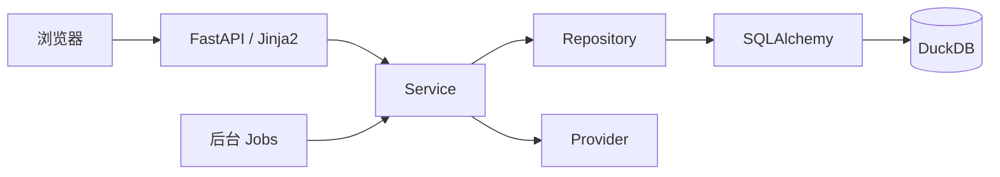
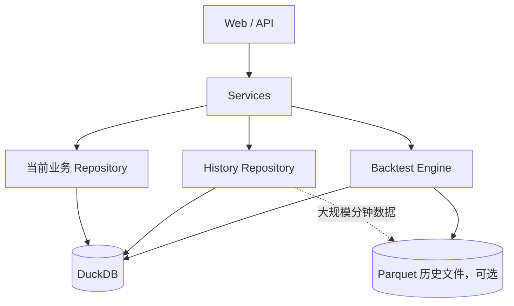
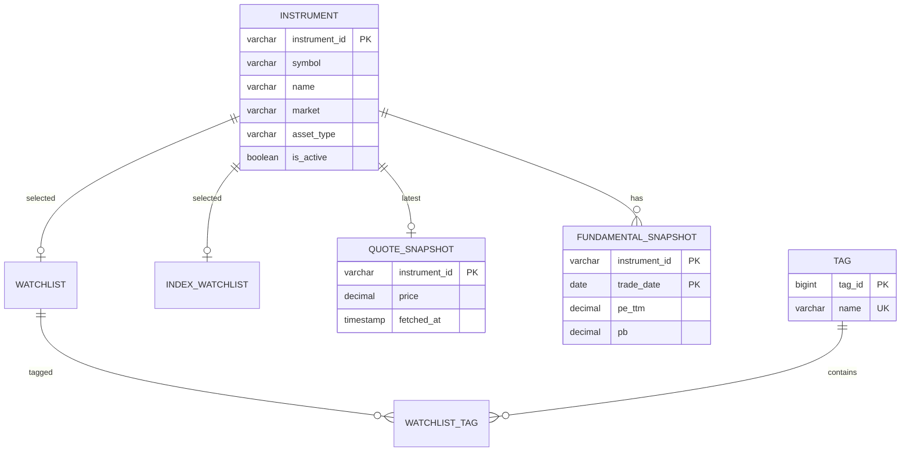
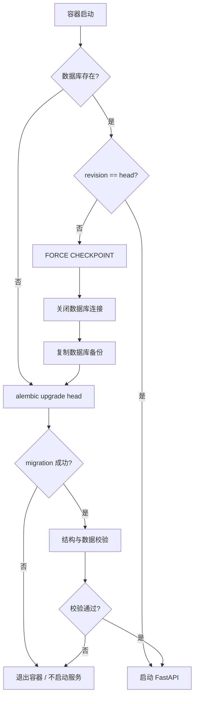

# stocksview DuckDB 演进版技术方案

> 版本：v1.0  
> 日期：2026-09-13  
> 基础项目：`ilevin/stocksview`  
> 目标：保留现有产品能力和分层架构，把 SQLite 替换为 DuckDB，并把数据库升级、历史行情和回测能力的地基提前打好。

---

## 1. 先说结论

这个新项目不应该被理解成“把 SQLite 连接字符串改成 DuckDB”。

更合适的做法是：

> **保留 stocksview 的应用架构，只重做持久化层的细节；当前业务数据继续通过 SQLAlchemy + Alembic 管理，历史行情和回测数据使用更适合 DuckDB 的批量读写方式；数据库升级从第一天就做到可备份、可验证、可恢复。**

第一版只做两件大事：

1. 让现有 stocksview 的功能在 DuckDB 上完整、稳定地跑起来；
2. 把数据库结构设计好，让以后加历史行情和回测时不用推翻重来。

**第一版不急着实现完整历史行情和回测。**  
否则很容易把“换数据库”“改表”“加行情”“做回测”四件高风险事情混在一起，最后出了问题很难定位。

---

## 2. 为什么这个方向是合适的

当前 stocksview 已经不是一个只有几张 SQLite 表的小脚本了。

现有项目已经有 FastAPI、Jinja2 + 原生 JS/CSS、SQLAlchemy 2.x、Repository、Service、Provider、后台 Jobs、Alembic 数据库迁移、健康检查、Provider 运行指标和 migration 测试。这些东西都应该保留。

当前项目从 v0.03 起已经明确使用：

```text
alembic upgrade head
```

来创建和升级数据库，而不是应用启动时用 `create_all()` 自动改表。这是一个非常好的基础。

所以新项目没有必要重构成另一套框架，也没必要去掉 SQLAlchemy。

---

# 3. 设计目标

## 3.1 必须做到

新项目第一版应继续支持：

- A 股 / 港股股票、ETF、指数；
- 自选列表和标签；
- 实时 / 延时行情；
- PE / PB / 股息率；
- 交易日历；
- 行情缓存；
- 后台刷新任务；
- Provider 切换；
- Provider 指标与 JobStatus；
- `/health` 和 `/api/admin/status`；
- Docker 部署；
- Alembic 升级。

UI 和 API 的行为尽量保持不变。

换句话说：

> 用户不应该因为数据库从 SQLite 换成 DuckDB，就需要重新学习怎么用这个项目。

## 3.2 为以后准备好

未来希望自然扩展出：

```text
历史日线
历史分钟线
复权因子
财务 / 估值历史
技术指标
数据同步
策略
回测
交易记录
收益曲线
回测指标
```

但是这些能力不能反过来把当前行情看板拖复杂。

因此从一开始就把：

```text
当前状态数据
历史行情数据
回测数据
```

看成三类不同的数据。

---

# 4. 总体架构

整体架构不推翻。



以后加入历史行情和回测后：



这里最关键的一点是：

> **页面上展示的“最新行情”和未来保存的“历史行情”不要混成一张表。**

首页只需要几十、几百条最新状态，不应该为了显示当前价格去扫描几百万行历史 K 线。

---

# 5. 技术栈

第一版建议：

| 项目 | 方案 |
|---|---|
| Python | 继续 Python 3.11+ |
| Web | FastAPI |
| 模板 | Jinja2 |
| 前端 | 原生 JS / CSS |
| ORM | SQLAlchemy 2.x |
| 数据库 | DuckDB |
| SQLAlchemy DuckDB 方言 | `duckdb-sqlalchemy` |
| 数据库迁移 | Alembic |
| 测试 | pytest |
| 部署 | Docker / docker compose |

截至 2026-09-13，可以先锁定：

```toml
duckdb = "==1.5.5"
duckdb-sqlalchemy = "==1.5.5.5"
```

建议**锁精确版本**，不要写成 `duckdb>=1.5`。

数据库和 SQLAlchemy 方言属于底层基础设施，不应该在一次普通 `pip install` 时悄悄升级。

`duckdb-sqlalchemy` 支持 SQLAlchemy ORM、Core、Alembic 和 reflection，但它是第三方维护的 SQLAlchemy dialect，不是 DuckDB 官方 Python 包。因此需要：

- 固定版本；
- 做集成测试；
- 把 DuckDB 特有代码集中放在数据库层；
- 升级依赖前先跑 migration 测试。

这样即使以后想更换 dialect，也不会影响 Service 和 API。

---

# 6. DuckDB 的运行方式

这是这次设计里最需要提前说清楚的地方。

DuckDB 很适合批量读取、批量写入、大范围扫描、聚合、时间序列分析、回测和 Parquet 查询。

但它不是用来模拟 PostgreSQL/MySQL 那种“几十个进程同时写数据库”的。

DuckDB 官方的并发模型更适合：

```text
一个进程
  ├── 多个请求线程
  ├── 后台行情任务
  ├── 后台估值任务
  └── DuckDB
```

因此生产部署明确规定：

```text
Uvicorn workers = 1
```

不要这样运行：

```bash
uvicorn app.main:app --workers 4
```

推荐：

```bash
uvicorn app.main:app --host 0.0.0.0 --port 8000 --workers 1
```

这并不代表只能同时处理一个 HTTP 请求。FastAPI 仍然可以处理并发请求，只是所有请求属于同一个应用进程。

## 6.1 写操作统一协调

建议在应用内部增加一个很轻量的写协调器 `WriteCoordinator`。

它不是复杂消息队列，本质上只是让涉及 DuckDB 的写操作有秩序地执行，尤其是：

```text
行情更新
估值更新
交易日历刷新
自选编辑
历史行情导入
```

规则：

- 一个请求一个短事务；
- 不把网络请求放在数据库事务里；
- 大批量导入使用单独批处理事务；
- 对会碰同一批行的后台任务加进程内锁；
- 遇到 DuckDB 写冲突可以有限重试。

---

# 7. 数据库连接层改造

当前 `app/db.py` 里的 SQLite 专用逻辑要清掉，包括：

- `check_same_thread=False`；
- `PRAGMA foreign_keys=ON`；
- SQLite 文件目录处理；
- Alembic 的 SQLite batch migration。

新的数据库 URL：

```yaml
database:
  url: "duckdb:///./data/stocksview.duckdb"
  backup_before_migrate: true
  backup_keep: 5
```

DuckDB 的线程数和内存限制暂时不要拍脑袋写死，先用默认值。真正部署到低内存机器后，再把 `memory_limit`、`threads` 做成可选配置。

---

# 8. 新项目不要继承 SQLite 的 Alembic 历史

新项目应该直接有自己的：

```text
0001_duckdb_baseline
```

而不是继续：

```text
0001_v002_baseline
0002_v003
0003_sqlite_to_duckdb
```

原因很简单：SQLite 和 DuckDB 是两种不同数据库。如果硬把“SQLite → DuckDB”塞进 Alembic 历史，以后每次新装项目，Alembic 都要理解一堆已经不存在的 SQLite 时代逻辑。

所以：

```text
老项目 migration 历史
        ↓
只属于 stocksview SQLite 版

新项目
        ↓
0001_duckdb_baseline
0002_xxx
0003_xxx
...
```

如果用户要把旧 SQLite 数据带过来，使用单独的导入工具。

---

# 9. 第一版数据库表设计

原则是：

> 小业务表讲数据完整性；未来的大行情表讲批量处理和分析效率。

不要给所有表套同一个模板。

## 9.1 instrument

当前项目已经有一个很合适的业务主键：`instrument_id`。

例如：

```text
cn:stock:600519
hk:stock:00700
cn:etf:510300
cn:index:000001
```

新项目不需要再人为加 `id = 123`。

建议：

```sql
CREATE TABLE instrument (
    instrument_id VARCHAR PRIMARY KEY,
    symbol VARCHAR NOT NULL,
    name VARCHAR NOT NULL,
    market VARCHAR NOT NULL,
    asset_type VARCHAR NOT NULL,
    exchange VARCHAR,
    currency VARCHAR,
    is_active BOOLEAN NOT NULL DEFAULT TRUE,
    created_at TIMESTAMPTZ NOT NULL,
    updated_at TIMESTAMPTZ NOT NULL
);
```

这样 API、Provider、Repository 和未来历史行情都使用同一个标识。

## 9.2 watchlist

自选项本质上就是“某个 instrument 是否进入自选”。

```sql
CREATE TABLE watchlist (
    instrument_id VARCHAR PRIMARY KEY,
    sort_order INTEGER NOT NULL DEFAULT 0,
    created_at TIMESTAMPTZ NOT NULL,
    FOREIGN KEY (instrument_id)
        REFERENCES instrument(instrument_id)
);
```

不再造一个 `watchlist.id`。

## 9.3 index_watchlist

同理：

```sql
CREATE TABLE index_watchlist (
    instrument_id VARCHAR PRIMARY KEY,
    sort_order INTEGER NOT NULL DEFAULT 0,
    created_at TIMESTAMPTZ NOT NULL,
    FOREIGN KEY (instrument_id)
        REFERENCES instrument(instrument_id)
);
```

## 9.4 tag

标签自己的 ID 仍然值得保留，因为标签名称可以修改。

DuckDB 如果需要自增语义，建议显式使用 sequence：

```sql
CREATE SEQUENCE seq_tag_id START 1;

CREATE TABLE tag (
    tag_id BIGINT PRIMARY KEY DEFAULT nextval('seq_tag_id'),
    name VARCHAR NOT NULL UNIQUE,
    created_at TIMESTAMPTZ NOT NULL,
    updated_at TIMESTAMPTZ NOT NULL
);
```

不要依赖 SQLite 风格的 `INTEGER PRIMARY KEY` 自动自增。

## 9.5 watchlist_tag

使用真正的关系键：

```sql
CREATE TABLE watchlist_tag (
    instrument_id VARCHAR NOT NULL,
    tag_id BIGINT NOT NULL,

    PRIMARY KEY (instrument_id, tag_id),

    FOREIGN KEY (instrument_id)
        REFERENCES watchlist(instrument_id),

    FOREIGN KEY (tag_id)
        REFERENCES tag(tag_id)
);
```

### 特别注意：不要使用 ON DELETE CASCADE

DuckDB 当前不支持外键级联删除。

所以删除自选时由 Service 在一个事务里：

```text
删除 watchlist_tag
删除 watchlist
```

删除标签时：

```text
先检查是否还有 watchlist_tag 引用
有引用 -> 拒绝删除
没有引用 -> 删除 tag
```

这也正好符合当前产品“被引用标签不能直接删除”的规则。

---

# 10. quote_snapshot：明确它只保存“当前行情”

当前 `quote_snapshot` 从业务行为看，本质上已经是“每个 instrument 的最新行情缓存”，不是完整行情历史。

新项目应该把这个语义正式固定下来。

```sql
CREATE TABLE quote_snapshot (
    instrument_id VARCHAR PRIMARY KEY,

    price DECIMAL(20, 6),
    change_percent DECIMAL(12, 6),
    volume_ratio DECIMAL(12, 6),
    previous_close DECIMAL(20, 6),

    source VARCHAR,
    source_timestamp TIMESTAMPTZ,
    fetched_at TIMESTAMPTZ NOT NULL,
    created_at TIMESTAMPTZ NOT NULL,

    FOREIGN KEY (instrument_id)
        REFERENCES instrument(instrument_id)
);
```

一只证券只有一行。

更新使用：

```sql
INSERT INTO quote_snapshot (...)
VALUES (...)
ON CONFLICT (instrument_id)
DO UPDATE SET
    price = EXCLUDED.price,
    ...
```

数据库自己保证“一只证券 = 一条当前行情”，Repository 不需要把多行读进 Python 再挑最新一条。

---

# 11. fundamental_snapshot

PE / PB / 股息率是按交易日保存的，因此它天然就是一个小型历史表。

```sql
CREATE TABLE fundamental_snapshot (
    instrument_id VARCHAR NOT NULL,
    trade_date DATE NOT NULL,

    pe_ttm DECIMAL(20, 6),
    pb DECIMAL(20, 6),
    dividend_yield_ttm DECIMAL(20, 6),

    source VARCHAR,
    fetched_at TIMESTAMPTZ NOT NULL,
    created_at TIMESTAMPTZ NOT NULL,

    PRIMARY KEY (instrument_id, trade_date),

    FOREIGN KEY (instrument_id)
        REFERENCES instrument(instrument_id)
);
```

不再增加无意义的整数 ID。

---

# 12. trading_calendar

天然主键就是 `market + trade_date`：

```sql
CREATE TABLE trading_calendar (
    market VARCHAR NOT NULL,
    trade_date DATE NOT NULL,
    is_open BOOLEAN NOT NULL,

    PRIMARY KEY (market, trade_date)
);
```

---

# 13. job_status

继续保留当前设计：

```sql
CREATE TABLE job_status (
    job_name VARCHAR PRIMARY KEY,
    last_started_at TIMESTAMPTZ,
    last_success_at TIMESTAMPTZ,
    last_error_at TIMESTAMPTZ,
    last_error VARCHAR,
    last_duration_ms BIGINT,
    consecutive_failures INTEGER NOT NULL DEFAULT 0,
    updated_at TIMESTAMPTZ NOT NULL
);
```

这是典型的小状态表，不需要特殊优化。

---

# 14. app_setting

建议增加一个简单的系统设置表：

```sql
CREATE TABLE app_setting (
    key VARCHAR PRIMARY KEY,
    value VARCHAR,
    updated_at TIMESTAMPTZ NOT NULL
);
```

它不替代 `config.yaml`，只存数据库自身相关的小状态。Tushare Token 等敏感配置仍然不应该写到这里。

---

# 15. 时间和数字类型怎么选

时间建议：

```text
交易日     -> DATE
具体时间   -> TIMESTAMPTZ
```

数据库保存真实时间点，页面展示时再转换为 `Asia/Shanghai`。不要把没有时区信息的“看起来像北京时间”的字符串到处保存。

当前行情和估值为了减少行为变化，可以继续使用 DECIMAL / Numeric。

未来大规模日线 / 分钟线的 `open/high/low/close/amount/adj_factor` 建议优先使用 `DOUBLE`。这是分析数据，不是会计账本；成交量使用 `BIGINT`。

---

# 16. Alembic 怎么继续用

继续用。

但是角色要说清楚：

> **Alembic 是数据库版本账本，不是自动改表魔法。**

`alembic revision --autogenerate` 可以生成草稿，但所有 migration 都必须人工检查。

不要把“autogenerate 出来什么，生产就直接跑什么”当流程。

---

# 17. DuckDB 表结构升级策略

DuckDB 支持很多常规 ALTER，例如：

```text
ADD COLUMN
DROP COLUMN
RENAME COLUMN
RENAME TABLE
ALTER TYPE
SET / DROP DEFAULT
SET / DROP NOT NULL
ADD PRIMARY KEY
```

DDL 也有事务语义。

但是当前 DuckDB 仍然不支持通用的：

```text
ADD CONSTRAINT
DROP CONSTRAINT
```

另外表上存在索引、约束等依赖时，一些 ALTER 会受限制。

所以统一定一个简单规则。

## 17.1 简单变更：直接 ALTER

增加 nullable 列、改列名、增加默认值等，可以直接 `ALTER TABLE`。

## 17.2 复杂变更：重建表

修改主键、增删复杂约束、危险类型转换等，统一：

```text
创建新表
    ↓
INSERT SELECT 搬数据
    ↓
校验数量和数据
    ↓
删除 / 改名旧表
    ↓
新表改成正式名称
```

例如：

```sql
BEGIN;

CREATE TABLE instrument_new (...);

INSERT INTO instrument_new (...)
SELECT ...
FROM instrument;

-- 校验

DROP TABLE instrument;
ALTER TABLE instrument_new RENAME TO instrument;

COMMIT;
```

看起来“笨”一点，但非常可预测。数据库升级最重要的不是炫技，而是出了问题时你知道发生了什么。

---

# 18. migration 必须包含数据校验

对于涉及数据搬迁的 migration，不能只执行 DDL。

应该检查：

```text
升级前多少行
升级后多少行
有没有 NULL 主键
有没有重复业务键
有没有丢 instrument
有没有孤儿关系
```

例如旧 `fundamental_snapshot` 10,000 行，新表也应该是 10,000 行，校验通过后才提交。

---

# 19. 启动前自动升级流程

现有 stocksview 已经采用：

```text
alembic upgrade head
成功
↓
启动 FastAPI
```

这个思路继续保留，但新项目升级前增加自动备份。

推荐：

```text
1. 检查数据库目录
2. 数据库不存在 -> 直接 alembic upgrade head
3. 数据库存在：
       打开数据库
       FORCE CHECKPOINT
       关闭连接
       复制数据库文件做备份
       alembic upgrade head
       执行升级后检查
4. 全部成功 -> 启动 FastAPI
5. 任意一步失败 -> 容器退出，不启动应用
```

建议封装成：

```text
scripts/db_upgrade.py
```

而不是把所有逻辑堆到 Docker CMD 里。

最终入口类似：

```bash
python scripts/db_upgrade.py &&
uvicorn app.main:app --host 0.0.0.0 --port 8000 --workers 1
```

---

# 20. 为什么升级前做 CHECKPOINT

DuckDB 使用 WAL（Write-Ahead Log）。可以简单理解为最近的修改有一部分可能还在事务日志里。

`CHECKPOINT` 会把 WAL 数据同步进正式 DuckDB 文件。

因此启动前备份应该：

```text
FORCE CHECKPOINT
关闭连接
复制 .duckdb 文件
```

而不是应用正在写的时候直接 `cp stocksview.duckdb backup.duckdb`。

---

# 21. 数据库备份

建议：

```text
data/
├── stocksview.duckdb
└── backups/
    ├── stocksview-20260913-070000.duckdb
    ├── stocksview-20260912-220000.duckdb
    └── ...
```

默认：

```yaml
backup_keep: 5
```

只有当：

```text
当前 Alembic revision != head
```

准备真正执行 schema migration 时才备份。

不要每次普通重启都产生一个没意义的副本。

---

# 22. 回滚策略

不要追求“任何升级都能 alembic downgrade”。

对于安全、非破坏性 migration，可以实现 downgrade。

对于破坏性或数据重写 migration，正式回滚方式是：

```text
停止新版本
↓
恢复升级前 DuckDB 备份
↓
启动上一版镜像
```

这比写一个看起来能 downgrade、实际上可能丢数据的脚本可靠得多。

---

# 23. SQLite 老数据怎么迁过来

不要让 Alembic 做。

单独写：

```text
scripts/import_sqlite.py
```

使用：

```bash
python scripts/import_sqlite.py   --source ./old-data/market.db   --target ./data/stocksview.duckdb
```

原则：

```text
旧 SQLite 只读
新 DuckDB 写入
旧文件绝不修改
```

导入顺序：

```text
instrument
↓
watchlist / index_watchlist
↓
tag
↓
watchlist_tag
↓
quote_snapshot
↓
fundamental_snapshot
↓
trading_calendar
↓
job_status
```

旧 `watchlist.id` 在新库不再需要。导入 `watchlist_tag` 时，把旧 `watchlist_id` 转换成对应 `instrument_id`。

如果旧库某只证券有多条 quote snapshot，只保留最新一条。

导入结束后输出类似：

```text
instrument              82 -> 82
watchlist               35 -> 35
index_watchlist           6 -> 6
tag                       8 -> 8
watchlist_tag            47 -> 47
quote_snapshot           35 -> 35
fundamental_snapshot   4210 -> 4210

重复 instrument_id：0
孤儿 tag 关系：0
失败：0
```

有问题就退出，不要悄悄“尽量导入”。

---

# 24. 历史行情怎么设计

这一部分第一版先设计接口，不急着全部实现。

核心思想：

> **历史行情是事实数据，不是当前状态缓存。**

## 24.1 日线

未来表建议叫：

```text
market_daily_bar
```

核心字段：

```text
instrument_id
trade_date

open
high
low
close
pre_close

volume
amount

adj_factor

source
fetched_at
```

逻辑唯一键可以是：

```text
instrument_id + trade_date + source
```

如果最终只允许一个权威数据源，也可以简化为 `instrument_id + trade_date`。

## 24.2 不要给几千万行行情造自增 ID

不要：

```text
id
instrument_id
trade_date
open
...
```

这个 `id` 对回测没有实际意义。回测真正关心的是“证券 + 时间”。

---

# 25. 大历史表不要滥用主键和外键

DuckDB 的 `PRIMARY KEY / UNIQUE / FOREIGN KEY` 会带来额外索引和维护成本。

对于 `instrument/tag/watchlist` 这种小业务表，该用约束就用。

但对于未来可能有 5000 万行分钟 K 线的大事实表，不要为了“看着正规”给每一列上约束和索引。

更好的做法：

```text
批量导入
↓
staging 去重
↓
数据检查
↓
写正式表
```

---

# 26. 利用 DuckDB 的 zonemap

DuckDB 会自动维护 min-max / zonemap 信息。

历史行情常见查询：

```sql
WHERE instrument_id = ?
  AND trade_date BETWEEN ? AND ?
```

因此数据尽量按：

```text
instrument_id
trade_date
```

组织和批量写入。

第一版不要看到慢查询就立刻 `CREATE INDEX`。只有出现真实慢查询，`EXPLAIN / EXPLAIN ANALYZE` 证明点查索引有价值，再增加。

---

# 27. 历史行情写入方式

不要用 ORM 一行行：

```python
for row in 1000000_rows:
    session.add(row)
```

历史行情应该走专门的批量通道：

```text
Provider
↓
DataFrame / Arrow / 批量数据
↓
Staging
↓
校验
↓
MERGE / INSERT SELECT
↓
正式历史表
```

Repository 仍然保留，只是：

```text
普通 Repository -> SQLAlchemy ORM
History Repository -> SQLAlchemy Core / DuckDB SQL / Arrow 批处理
```

上层 Service 不需要知道差别。

---

# 28. data_sync_state

历史数据一多，一定要知道：

```text
我同步到哪一天了？
哪个证券失败了？
上一次成功是什么时候？
```

所以未来增加：

```text
data_sync_state
```

包含：

```text
dataset
instrument_id
last_trade_date
last_success_at
last_attempt_at
status
last_error
```

---

# 29. 复权数据不要直接覆盖原始行情

以后支持前复权 / 后复权时，不要把原始 close 直接改掉。

至少保留：

```text
原始 OHLC
adj_factor
```

回测时根据参数选择：

```text
raw
qfq
hfq
```

这样同一份原始行情可以得到不同复权结果。

---

# 30. 分钟行情什么时候用 Parquet

日线第一阶段直接放 DuckDB 完全合理。

分钟线以后如果越来越大，可以采用：

```text
DuckDB 主数据库
+
Parquet 历史文件
```

例如：

```text
data/history/minute/
├── market=CN/
│   ├── year=2025/
│   │   ├── month=01/
│   │   └── month=02/
│   └── year=2026/
└── market=HK/
```

DuckDB 可以直接查询 Parquet。

这不代表换掉 DuckDB：

```text
DuckDB 负责 SQL 查询和分析
Parquet 只是大规模冷历史数据的存储格式
```

不要分得太细，比如“一只股票一天一个 Parquet”通常会产生海量小文件。更合理的是按 `market/year/month` 等粒度组织，并保持足够大的分区。

---

# 31. 回测模块怎么留接口

未来建议增加：

```text
app/backtest/
├── engine.py
├── strategy.py
├── broker.py
├── portfolio.py
└── metrics.py
```

策略代码不要塞进 Repository，数据访问仍然走 History Repository。

---

# 32. 回测需要保存什么

至少四类数据。

## 32.1 backtest_run

保存：

```text
run_id
strategy_name
strategy_version
start_date
end_date
universe
initial_cash
parameters
adjustment_mode
code_version
data_version
status
started_at
finished_at
error
created_at
```

`run_id` 建议用 UUID / ULID 字符串。

## 32.2 backtest_trade

每笔模拟成交：

```text
run_id
instrument_id
trade_time
side
price
quantity
fee
slippage
reason
```

## 32.3 backtest_equity

收益曲线：

```text
run_id
time
nav
cash
market_value
drawdown
```

## 32.4 backtest_metric

汇总指标：

```text
run_id
total_return
annual_return
max_drawdown
sharpe
win_rate
turnover
...
```

---

# 33. 回测最重要的是“可复现”

很多回测系统最后最大的问题不是算得慢，而是三个月后不知道当时到底用了什么数据、什么参数、什么代码。

所以 `backtest_run` 必须保存：

```text
参数
策略版本
代码版本
数据版本
复权方式
开始结束日期
```

如果项目在 Git 中运行，可以保存 Git commit hash。

---

# 34. 将来做并行回测要注意

不要让多个独立进程同时读写同一个 live DuckDB 文件。

未来需要多进程时，推荐三种方式：

### A. 历史行情使用 Parquet

多个回测 worker 只读 Parquet，结果由主应用统一写 DuckDB。长期最推荐。

### B. 生成只读快照 / 独立副本

批量回测前生成数据快照，每个 worker 读取自己的只读副本。

### C. worker 输出文件

worker 生成 `run-xxx.parquet`，最后由主进程统一导入 DuckDB。

总之：

> **并行算可以，并行抢着写同一个 DuckDB 文件不要做。**

---

# 35. 推荐的代码目录

为了保留 stocksview 架构，第一版不建议大改目录：

```text
app/
├── main.py
├── config.py
├── version.py
├── db.py
├── api/
├── models/
├── schemas/
├── providers/
├── observability/
├── repositories/
├── services/
├── jobs/
├── templates/
└── static/

alembic/
├── env.py
└── versions/
    ├── 0001_duckdb_baseline.py
    ├── 0002_xxx.py
    └── ...

scripts/
├── db_upgrade.py
├── db_backup.py
└── import_sqlite.py

tests/
├── unit/
├── integration/
└── migrations/
```

以后加历史：

```text
app/models/history.py
app/repositories/history.py
app/services/history.py
app/providers/history/
```

以后加回测：

```text
app/backtest/
```

---

# 36. app/db.py 的职责

保持简单，只负责：

```text
创建 Engine
创建 Session
数据库连接检查
数据库版本查询
必要的 DuckDB 初始化
```

不要把备份、migration、SQLite 导入、历史行情 ETL 全塞进 `db.py`。

---

# 37. Alembic env.py 改造

当前 SQLite 版使用 `render_as_batch=True`，这是 SQLite 迁移时常用的特殊模式。

DuckDB 版应该去掉 SQLite 特有的 batch 配置。

继续保留：

```text
target_metadata = Base.metadata
```

但 `autogenerate` 只作为候选 migration，必须人工审核。

---

# 38. 命名规范

表名统一 `snake_case`。

时间字段统一：

```text
created_at
updated_at
fetched_at
started_at
finished_at
```

交易日统一：

```text
trade_date
```

证券标识永远：

```text
instrument_id
```

不要一会儿 `symbol_id`，一会儿 `stock_id`，一会儿 `security_id`。

数据源统一：

```text
source
```

---

# 39. 不建议一开始使用 DuckDB 多 schema

理论上可以：

```text
core.instrument
market.daily_bar
backtest.run
```

但第一版不建议。

原因：

- 当前项目模型都在默认 schema；
- Alembic 多 schema 更复杂；
- 当前规模还不需要；
- 表名前缀和代码目录已经足够清楚。

先用：

```text
instrument
quote_snapshot
market_daily_bar
backtest_run
```

就够了。

---

# 40. API 和 UI 兼容策略

第一版数据库改造成功的标准之一：

> 前端基本不用知道数据库换了。

现有 `/api/watchlist`、`/api/index-watchlist`、`/api/tags`、`/api/quotes`、`/api/admin/status` 等响应结构尽量不变。

`index/watchlist/tags` 等页面也尽量不改。

---

# 41. health 增加数据库版本信息

建议 `/health` 扩展为：

```json
{
  "status": "ok",
  "database": "ok",
  "database_engine": "duckdb",
  "database_revision": "0003_xxx",
  "version": "..."
}
```

不要暴露本机绝对路径、Token、连接密钥。

`/api/admin/status` 以后还可以增加 DuckDB 版本、数据库文件大小、Alembic revision、最近升级时间和最近备份时间。

---

# 42. Docker 策略

继续保持：

```text
一个应用容器
一个 data volume
一个 config.yaml
```

数据库：

```text
/app/data/stocksview.duckdb
```

不要为了 DuckDB 再启动一个“数据库容器”。DuckDB 是嵌入式数据库，加 server 容器反而把事情搞复杂。

---

# 43. .gitignore

至少：

```gitignore
data/
*.duckdb
*.duckdb.wal
*.db
*.db-wal
backups/
*.parquet
config.yaml
```

如果以后需要提交少量测试 Parquet，再对 fixture 做例外。

---

# 44. 数据库版本和应用版本怎么配合

应用版本：

```text
v0.1.0
v0.2.0
```

数据库版本：

```text
0001_duckdb_baseline
0002_add_xxx
```

两者不要强行一一对应。

比如 `v0.2.1` 可能只修 UI，不需要数据库升级。真正判断数据库结构版本，靠 Alembic revision。

---

# 45. DuckDB 自身版本怎么升级

不要总把：

```text
升级应用代码
升级 DuckDB
改 schema
```

三件事绑在一次发布里。

普通功能发布时 DuckDB 版本尽量不动。

专门升级 DuckDB 时，CI 验证：

```text
旧版 DuckDB 创建的测试库
↓
新版 DuckDB 打开
↓
执行 migration
↓
跑 integration tests
↓
跑备份 / 恢复测试
```

通过后才更新依赖锁。

---

# 46. 测试策略

## 46.1 单元测试

继续覆盖 Service、Provider、业务逻辑、市场状态、标签逻辑等。

## 46.2 Repository 集成测试

不要拿 SQLite 内存数据库代替 DuckDB。

数据库逻辑要真的跑临时 `.duckdb` 文件，覆盖 CRUD、UPSERT、事务、FK、唯一约束、时间类型、复合主键和 Repository 查询。

## 46.3 migration 从零测试

CI 每次：

```text
空目录
↓
alembic upgrade head
↓
检查全部表
↓
运行 Repository smoke test
```

## 46.4 旧版本升级测试

为重要 revision 保留小 fixture：

```text
database_at_0001.duckdb
database_at_0002.duckdb
```

执行：

```text
旧库
↓
alembic upgrade head
↓
检查原始数据仍在
↓
检查新字段 / 新表
```

## 46.5 migration 失败测试

构造错误数据，确认 migration 失败后事务回滚、应用不启动、备份可恢复。

## 46.6 SQLite 导入测试

准备一个旧版 SQLite fixture，重点检查：

```text
watchlist_tag ID 转换
quote_snapshot 去重
fundamental 日期
```

---

# 47. 性能测试

第一阶段不必跑亿级 benchmark。

建立三个现实场景：

### 当前应用

```text
100 个自选
20 个标签
10 年估值
```

### 日线

```text
5000 个证券
15 年日线
```

大约千万级行数。

### 分钟线探索

生成百万 / 千万级分钟数据。

测：

```text
单证券区间查询
一篮子证券区间查询
全市场某日扫描
收益率计算
window / rolling
group by
```

这比跑一个和产品无关的数据库跑分有价值。

---

# 48. 索引策略

小业务表需要数据完整性的 `PRIMARY KEY / UNIQUE / FOREIGN KEY` 正常使用。

历史大表先不要乱建索引，优先依赖：

```text
列式存储
zonemap
合理数据顺序
批量查询
```

只有真实慢查询经过 `EXPLAIN / EXPLAIN ANALYZE` 证明点查索引有价值，再增加。

---

# 49. 错误处理

数据库错误分三类。

### 业务错误

例如标签仍被引用，返回正常业务错误。

### 暂时性写冲突

短暂等待，有限重试 1～3 次。

### 数据库 / migration 严重错误

记录日志，健康检查失败，阻止应用启动或标记任务失败。

不要在生产环境自动“删表重建”。

---

# 50. 日志

至少记录：

```text
DuckDB version
数据库 revision
migration from -> to
migration 耗时
备份文件
备份大小
数据库文件大小
CHECKPOINT 是否成功
SQLite 导入统计
历史行情同步统计
```

不要记录 Tushare Token 或完整敏感配置。

---

# 51. 分阶段实施计划

## Phase 0：技术验证

先验证风险最大的部分：

```text
SQLAlchemy ORM CRUD
duckdb-sqlalchemy
Alembic fresh migration
复合主键
Sequence
ON CONFLICT
FK 行为
复杂表 rebuild migration
后台任务 + Web 请求同时访问
Docker 单进程运行
```

不做 UI。

## Phase 1：现有功能完整迁移到 DuckDB

范围：

```text
换依赖
改 app/db.py
改 config
调整 models
新建 0001_duckdb_baseline
调整 repositories
去除 SQLite 专用代码
去除 render_as_batch
Docker workers 固定 1
全部现有测试跑通
新增 DuckDB integration tests
```

目标：

> 功能和当前 stocksview 一样，但底层已经彻底没有 SQLite。

## Phase 2：把升级能力做扎实

加入：

```text
db_upgrade.py
升级前 CHECKPOINT
自动备份
备份保留策略
migration 数据校验
旧 revision -> head 测试
恢复演练
SQLite import 工具
health revision
```

## Phase 3：历史行情

实现 History Provider、History Repository、`data_sync_state`、`market_daily_bar`、批量导入、补数据、去重、增量更新和数据质量检查。

先日线，不要日线、分钟线、Tick 一起上。

## Phase 4：回测

实现 Backtest Engine、Strategy 接口、Portfolio、Broker Simulation、Trade、Equity Curve、Metrics 和 Run metadata。

先做日线级回测，架构稳定后再考虑分钟级。

---

# 52. Phase 1 验收标准

- [ ] 全新 `docker compose up` 可以自动创建 DuckDB
- [ ] 项目不再依赖 SQLite
- [ ] 不再执行 SQLite PRAGMA
- [ ] Alembic 不再使用 SQLite batch migration
- [ ] 现有页面功能正常
- [ ] 现有 API 行为不变
- [ ] Provider 行为不变
- [ ] 行情后台刷新正常
- [ ] 估值刷新正常
- [ ] 标签功能正常
- [ ] 交易日历正常
- [ ] JobStatus 正常
- [ ] `/health` 正常
- [ ] `/api/admin/status` 正常
- [ ] 重启后数据不丢
- [ ] quote_snapshot 一只证券最多一行
- [ ] 全部 Repository 集成测试使用真实 DuckDB
- [ ] `alembic upgrade head` 可以从空库执行
- [ ] migration 失败时应用不会启动
- [ ] Uvicorn 生产环境只有一个 worker

---

# 53. Phase 2 验收标准

- [ ] 有升级前自动备份
- [ ] 只在需要 migration 时备份
- [ ] CHECKPOINT 后再复制数据库
- [ ] 可配置保留最近 N 份备份
- [ ] 能从前一个 revision 升级到 head
- [ ] migration 不丢已有数据
- [ ] 有备份恢复测试
- [ ] 旧 SQLite 数据可以一次性导入
- [ ] 导入工具不会修改旧 SQLite
- [ ] 导入后输出统计和校验结果
- [ ] `/health` 可以看到 schema revision

---

# 54. 几个明确“不做”的事情

第一版明确不做：

- 不做 PostgreSQL；既然目标是 DuckDB，就先把 DuckDB 路线走通。
- 不加 Redis；当前规模没必要。
- 不拆微服务；Provider、Jobs、Web 留在同一个应用进程。
- 不为了回测上 Celery / Kafka。
- 不把所有历史数据都 ORM 化。
- 不给所有表都加自增 ID。
- 不让多个 Uvicorn worker 同时打开数据库写。
- 不把 SQLite → DuckDB 当 Alembic migration。
- 不自动执行未经审核的 Alembic autogenerate。
- 不在第一版同时开发完整历史行情和完整回测。

---

# 55. 主要风险与处理方式

| 风险 | 怎么处理 |
|---|---|
| SQLAlchemy DuckDB dialect 是第三方维护 | 固定版本；集成测试；DuckDB 特有代码隔离 |
| DuckDB 不适合多进程同时写 | 生产固定单应用进程 |
| 后台任务和请求同时写同一行 | 短事务 + 写协调 + 有限重试 |
| DuckDB 不支持 FK `ON DELETE CASCADE` | Service 显式删除关系数据 |
| 某些约束不能直接 ALTER | migration 使用“建新表→搬数据→换表” |
| 大历史表约束太多拖慢写入 | 大事实表少建 PK/FK/ART 索引 |
| ORM 插入历史行情太慢 | History Repository 使用批处理 |
| 数据库文件越来越大 | 当前状态和历史数据分开；分钟数据可转 Parquet |
| 数据库升级失败 | migration 前备份 + 事务 + 阻止应用启动 |
| DuckDB 版本升级导致兼容问题 | 固定版本，单独做数据库引擎升级测试 |
| 回测以后需要多进程 | worker 读 Parquet/快照，结果由主进程统一写入 |

---

# 56. 第一版最终结构

```text
                     stocksview DuckDB
                           │
             ┌─────────────┴─────────────┐
             │                           │
         当前产品                    未来分析能力
             │                           │
       FastAPI/Jinja                History / Backtest
             │                           │
          Service                      Service
             │                           │
       Repository                 History Repository
             │                           │
       SQLAlchemy ORM           SQLAlchemy Core / DuckDB SQL
             │                           │
             └─────────────┬─────────────┘
                           │
                        DuckDB
                           │
                    （未来可读 Parquet）
```

当前的小表：

```text
instrument
watchlist
index_watchlist
tag
watchlist_tag
quote_snapshot
fundamental_snapshot
trading_calendar
job_status
app_setting
```

以后自然增加：

```text
market_daily_bar
data_sync_state
market_minute_bar / Parquet
backtest_run
backtest_trade
backtest_equity
backtest_metric
```

---

# 57. 最关键的十个决定

1. **保留现有 FastAPI / Provider / Repository / Service / Jobs 架构。**
2. **DuckDB 是新项目唯一主数据库，不再保留 SQLite 运行路径。**
3. **新项目重新建立 `0001_duckdb_baseline`，不继承 SQLite migration 历史。**
4. **SQLite 老数据使用单独导入工具迁移。**
5. **继续使用 SQLAlchemy + Alembic，但 migration 必须人工审核。**
6. **生产环境只运行一个写 DuckDB 的应用进程。**
7. **最新行情和历史行情彻底分开。**
8. **小业务表重完整性，大历史表重批量分析，不滥用索引和代理 ID。**
9. **复杂 schema 变更统一允许“建新表 → 搬数据 → 换表”。**
10. **每次数据库结构升级前自动备份，升级失败不启动应用。**

---

# 58. 推荐的第一批开发任务

```text
T01  建新项目 / 保留 stocksview 主结构

T02  引入 DuckDB + duckdb-sqlalchemy

T03  重写 app/db.py，清理 SQLite 专用逻辑

T04  重做 core models
     instrument
     watchlist
     index_watchlist
     tag
     watchlist_tag
     quote_snapshot
     fundamental_snapshot
     trading_calendar
     job_status
     app_setting

T05  创建 0001_duckdb_baseline

T06  调整 Repository
     特别是 quote_snapshot upsert

T07  跑通所有现有 Service / API / UI

T08  改 Docker，强制单 worker

T09  加 DuckDB Repository integration tests

T10  加 fresh-db migration tests

T11  实现 db_upgrade.py

T12  实现 migration 前 checkpoint + backup

T13  实现 old revision -> head migration tests

T14  实现 import_sqlite.py

T15  加 health database_revision

T16  做恢复演练

T17  发布 DuckDB 版第一稳定版本
```

建议 **T01～T10 作为第一个里程碑**，T11～T16 作为第二个里程碑，历史行情放第三个里程碑，回测放第四个里程碑。

---

# 59. 最终建议

我建议这个项目不要定位成：

> stocksview 的 SQLite 替换版

而是定位成：

> **一个以 DuckDB 为本地分析内核的个人证券研究工具。**

当前行情看板只是第一层能力。

以后可以自然长成：

```text
当前行情
    ↓
历史行情
    ↓
数据研究
    ↓
策略
    ↓
回测
```

前提是第一步不要急着把所有功能一次写完。

**先把数据库、迁移、备份、单进程写入、核心表结构这几个基础问题做好。**

这些地基做好以后，加历史行情和回测是在现有结构上“长功能”；如果地基没做好，历史数据一多，后面就会变成一边加功能一边重修数据库。

---

# 60. 参考资料

本方案主要参考以下项目和官方文档，并结合 stocksview 当前代码结构做了取舍。

- stocksview：<https://github.com/ilevin/stocksview>
- DuckDB Concurrency：<https://duckdb.org/docs/lts/connect/concurrency>
- DuckDB ALTER TABLE：<https://duckdb.org/docs/current/sql/statements/alter_table>
- DuckDB CREATE SEQUENCE：<https://duckdb.org/docs/current/sql/statements/create_sequence>
- DuckDB CREATE TABLE / Foreign Key Limitations：<https://duckdb.org/docs/current/sql/statements/create_table>
- DuckDB Indexing：<https://duckdb.org/docs/current/guides/performance/indexing>
- DuckDB CHECKPOINT：<https://duckdb.org/docs/current/sql/statements/checkpoint>
- DuckDB Partitioned Writes：<https://duckdb.org/docs/lts/data/partitioning/partitioned_writes>
- duckdb-sqlalchemy：<https://pypi.org/project/duckdb-sqlalchemy/>
- DuckDB Python package：<https://pypi.org/project/duckdb/>

---

## 附录 A：建议的 v1 表关系



---

## 附录 B：数据库升级流程



---

## 附录 C：一句话架构原则

> **用 SQLAlchemy 保住现有工程结构，用 DuckDB 原生能力处理未来的大数据，用 Alembic 管版本，用备份兜底升级，用单进程写入换稳定性。**
